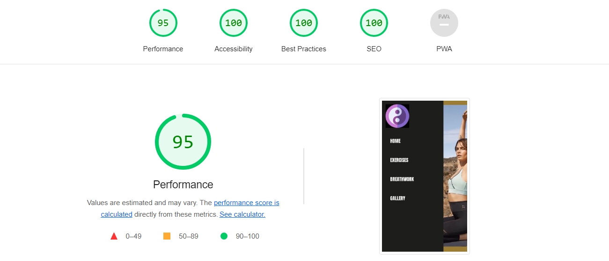
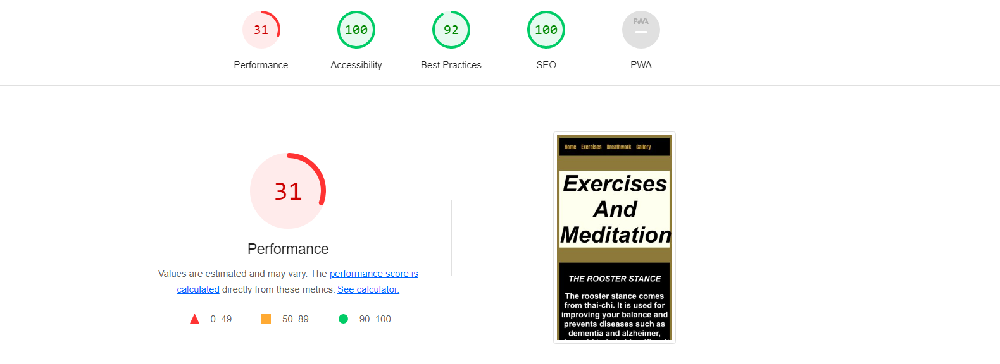
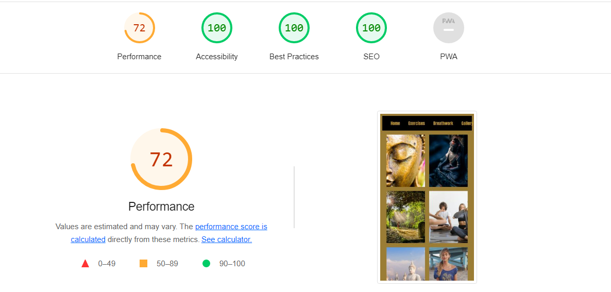
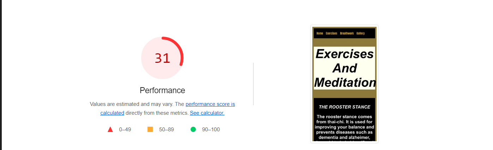

# MindFullness

Mindfullness, is a website dedicated to everyone that wants to improve their mental and physical wellbeing.
Whether you are stressed out from work or just want to explore new mindfulness techniques to better yourself and others. 
This meditation website has what you are searching for, from a very beginner friendly breathing meditation,
to a more advanced breathing technique called the Wim Hoff method. 

# Features

### Interactive navigation bar
 * Featured on the homepage this navigation bar is fully interactive,
 allowing users to access home,exercises,gallery and breathwork sections.
 

### Videos  
* clickable youtube videos with built in sound player and pause feature,
  so that the user does not have to navigate to youtube in a separate tab.

### Sound player
* sound player with looped rain audio for allowing the user to meditate as long as they wish. 

### Gallery
 * The gallery allows the user to access relaxing images from all over the world.
   In order to bring on a more peaceful mental state.
   

### Other Screens 
* This website works on multiple screen sizes, that means it can be accessed on phones and tablets.

# Testing

 * Please find below my testing process for all pages via mobile and web.

 ### Navigation bar on homepage
 * The navigation bar on left side is responsive when clicked and highlights sections in yellow when hovering over it as intended.

 * Home-When selecting home the browser redirects to home as intended.

 * Gallery-When selecting gallery the browser redirects to gallery as intended.

 * Exercise-When selecting exercises the browser redirects to exercises as intended.
 
 * Breathwork-When selecting breathwork the browser redirects to breathwork as intended.

 * Tested on small screens and it works as intended.

 ### Navigation bar in exercise,breathwork and gallery sections
 *  Home-When selecting home the browser redirects to home as intended.

 * Gallery-When selecting gallery the browser redirects to gallery as intended.

 * Exercise-When selecting exercises the browser redirects to exercises as intended.
 
 * Breathwork-When selecting breathwork the browser redirects to breathwork as intended.

 * Tested on small screens and it works as intended.

 ### Text
 * Checked that all text is grammatical using grammarly application and that there were no typos.
 ### Media
 * Checked that all videos and pictures were responsive when clicking on both phones and laptops, by asking friends to access the 
  website and click on the videos to see if they worked and by checking using my phone.
 ### Responsiveness
 * Checked that the website is responsive using google inspector tool to adjust screen size and find breakpoints. Worked as intended.
 ### Gallery
 * I have tested the images in the gallery and they do not appear pixelated on small screens and are responsive.
 # Lighthouse
 * Used Lighthouse in Chrome DevTools to confirm that the colors and fonts being used in throughout the website are easy to read.
 ### Lighthouse reports
      
 
 
 
 
 
# Validators
# HTML
* No errors were returned when passing through the official W3C validator

# CSS
No errors were found when passing through the official (Jigsaw) validator

 
 # Bugs and other issues
* The low performance in the lighthouse report is showing  because of the YouTube videos that use java script and YouTube ads. To fix this I would have to remove the YouTube videos, but I don't believe it is necessary as the site performs very well even with this low performance report.

# Deployment
  * The site was deployed to GitHub pages on my 5th attempt, my website just kept crashing when being uploaded but I managed to make it work by reuploading it to the root directory. 
 
 The steps I used to deploy are as follows:
 * In the GitHub repository, navigate to the Settings tab
 * From the source section drop-down menu, select the Master Branch
 * Once the master branch has been selected, the page will be automatically refreshed with a detailed ribbon display to indicate the successful deployment.
* The live link can be found here @[Mindfullness](https://gabriel5638.github.io/mindfullness-website/)

# Credits
   

**Content**
- The text used in breathwork was inspired by [website](https://www.wimhofmethod.com/practice-the-method)

- Used this video as inspiration for creating my homepage navigation bar > [youtube video](https://www.youtube.com/watch?v=oLgtucwjVII)

- Adapted this to make my own navigation bar for breathwork exercise and gallery sections > [youtube video](https://www.youtube.com/watch?v=FEmysQARWFU)

- This video helped me add youtube videos to my website [youtube video](https://www.youtube.com/watch?v=ly36kn0ug4k)

- This video helped me make the images in gallery responsive [youtube video](https://www.youtube.com/watch?v=Trw_9lisYVY)

- Got the breathwork video from [youtube](https://www.youtube.com/watch?v=0BNejY1e9ik)

- Got the rooster stance video from [youtube](https://www.youtube.com/watch?v=pG_xKR5odMk)

- Got the horse stance video from [youtube](https://www.youtube.com/watch?v=mT8FbCZOyFo)

**Media**

- All the images were taken from google images [google](https://images.google.com/)

- The navigation bar logo on the home page was taken from google images [google](https://www.google.com/search?q=ying+yang+logo+purple&tbm=isch&ved=2ahUKEwju3N-W0sL8AhWSHcAKHTCbCEYQ2-cCegQIABAA&oq=ying+yang+logo+purple&gs_lcp=CgNpbWcQAzoECAAQQzoFCAAQgAQ6CwgAEIAEELEDEIMBOggIABCABBCxAzoGCAAQBRAeOgkIABCABBAKEBg6BwgAEIAEEBg6BggAEAgQHjoECAAQHlCPC1imQ2CBRGgKcAB4AIABNIgBvwmSAQIzMpgBAKABAaoBC2d3cy13aXotaW1nwAEB&sclient=img&ei=1E7AY-6iFpK7gAawtqKwBA&bih=754&biw=1536)

- The rain audio taken from Pexels however I had to converted the video in a mp3 sound format to use it  [Pexels](https://www.pexels.com/search/videos/rain/)
